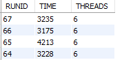
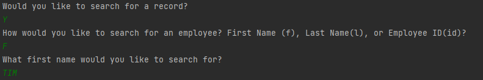
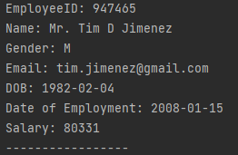
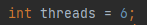

# Employee CSV Migration Project

The Employee CSV Migration Project, is a small application used to generate an MYSQL database and move data from a supplied CSV file into it, it makes use of functional programming as well as multithreading
## Table of Contents

1. [Instructions](#instructions)
2. [Features](#features)
3. [Project Motivation](#project)
4. [Testing](#testing)
5. [License](#license)


## Instructions<a name="instructions"><a/>
1. Pull from git.
2. Change the MYSQL database connection to be one that will connect to your own SQL server, it is advised that this is a MYSQL server as we cannot guarantee that this will work with other SQL server types.
3. Change the CSV filePath name, so that it is the CSV file you wish to convert.
4. Run the application.
5. The time take to move the data will be recorded in two parts, firstly how quickly the Employee objects are created, and secondly how quickly those objects are written to your Database.
6. After the data is written the application will ask you would like to search for an employee, you can use the keywords: y or yes, capitals are allowed anything else will quit the application.
7. If you choose to search for an employee, you will ba asked how you would like to search for an employee: id number, first name or last name.

## Features <a name="features"><a/>
### High Speed Conversion of Data
This program will quickly move all the data from a CSV file into an MYSQL database very quickly, an average of roughly 4 seconds for a CSV file of about 65000 rows with 10 columns of data in each.


 
*Figure 1. - The times shown above are in ms.*


### Search Function
One of the newer features of this program is that with the command line you can now search for employees by their ID number, first name or last name.



### MultiThreading
One of the biggest points of interest in this project, is the application of multithreading. The default number of threads used in this application is 6 however the thread variable can be modified. Each thread opens its own connection to the database in order to speed up write times.



## The Motivation behind the project <a name="project"><a/>
The motivation behind this project was to learn more about how important topics like: functional programming and multithreading actually worked, and how they can be appropriately applied to a task in order to make it more efficient. As well as learning more about how to read information from files and transform this read information into SQL commands that could be input into a database automatically.


#### What problem does it solve?
this project has begun to solve the problem of having to manually move records from a csv file into a more accessible format of a database. not only that but it also does it very quickly with the fastest time of completion being 4 seconds


#### What did I learn?
I have learned how to structure a lambda expression, which at first was difficult to understand but as I used them more and more they became easier to understand and use.


## Testing <a name="testing"><a/>

During various phases of development there has been a number of JUnit tests that have been carried out, here are couple from various sections of the application.

```java
@Test
    public void givenAnUnacceptablePrefixTooLongDoesReturnFalse(){
        String testString = "HisLordShip";
        RegexPatterns regPat = new RegexPatterns();
        assertFalse(regPat.regexPrefix(testString));
    }
    @Test
    public void givenAnUnacceptablePrefixWrongCharacterDoesReturnFalse(){
        String testString = "mr@";
        RegexPatterns regPat = new RegexPatterns();
        assertFalse(regPat.regexPrefix(testString));
    }
    @Test
    public void givenSQLInjectionPrefixReturnsFalse(){
        String testString = "DROP TABLE EMPLOYEE_DATABASE";
        RegexPatterns regPat = new RegexPatterns();
        assertFalse(regPat.regexPrefix(testString));
    }
```


## Future Project Direction <a name="future"><a/>
I would like to add further search parameters, currently there is only 3, and I would like to increase this. 
Additionally, I would like to create an actual GUI for this so that it is no longer command line based and instead you can input the CSV file into a search bar, along with the number of threads wanted. and the display would show the time taken to convert the file, then it would change to show the available search options you can select from.

## License <a name="license"><a/>
[MIT](https://choosealicense.com/licenses/mit/)